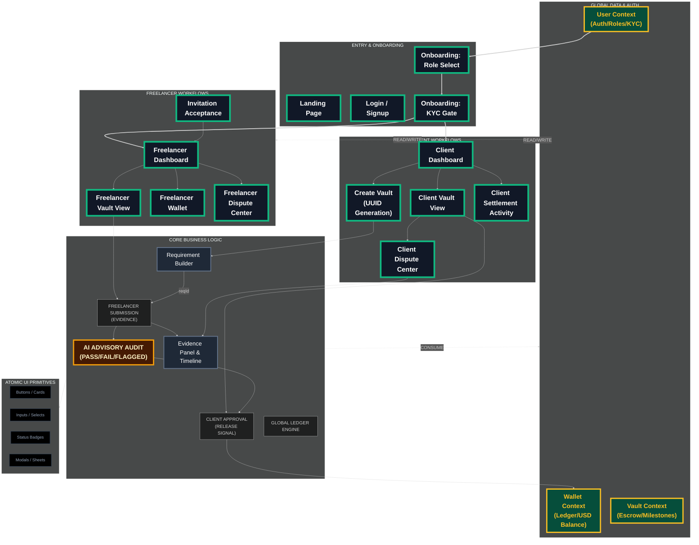
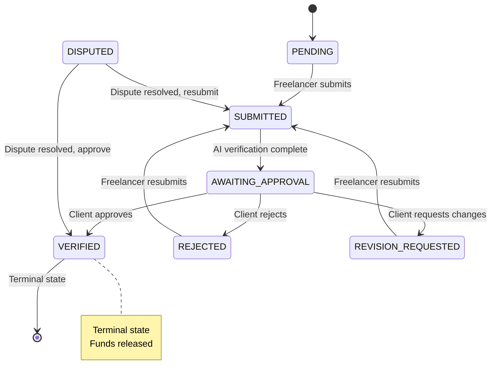

# Cleard Frontend Documentation

Welcome to the frontend documentation for **Cleard (Dayle)**, a high-trust settlement and secure escrow platform. This project is built with a focus on visual excellence, security, and architectural integrity.

## Tech Stack

- **Framework**: [Next.js 16 (App Router)](https://nextjs.org/)
- **Runtime/Logic**: [React 19](https://react.dev/)
- **Styling**: [Tailwind CSS 4](https://tailwindcss.com/) (Vanilla CSS approach)
- **Animations**: [Framer Motion](https://www.framer.com/motion/)
- **UI Components**: [Radix UI](https://www.radix-ui.com/) & [Lucide Icons](https://lucide.dev/)
- **State Management**: React Context API (`UserContext`, `WalletContext`, `VaultContext`)
- **Data Fetching**: Mock API System (Simulated Latency)

## Comprehensive Architecture Diagram



## Canonical v2 Enforcement Rules

> [!IMPORTANT]
> These rules are **mandatory** and must be enforced server-side:

1. **AI results are advisory only** and never release funds automatically.
2. **All money movement** is initiated only by explicit client approval actions.
3. **Every milestone** follows strict status transitions enforced server-side.
4. **Every dispute** must reference `vaultId` + `milestoneId` + `reasonCode`, and requirement disputes must include `reqId`.
5. **AI Audit Results** are always displayed prominently in the Evidence Panel using the `EvidencePanel` component, showing PASS/FAIL/FLAGGED status.
6. **Vault Funding** is a distinct action initiated by the client via the "Fund Vault" button on DRAFT or PENDING_FUNDING vaults.
7. **Status enums** are stored and transmitted in **UPPERCASE** only.
8. **All milestones follow the same workflow**: Freelancer submits → AI audit (advisory) → Client approval (mandatory).
9. **Invisible Blockchain**: The UI MUST NOT display technical chain terms (wallet, token, gas, chain, hash). Use generic terms like 'Balance', 'Processing', 'Funds'.

## Canonical Data Contracts

> [!WARNING]
> Frontend expects these exact shapes. Backend MUST match or provide adapters.

### Vault

```typescript
{
  id: string;                    // e.g., "v_1"
  title: string;
  description?: string;
  type: string;                  // "development" | "design" | "content_ai" | "consulting"
  status: VaultStatus;           // UPPERCASE enum
  totalAmount: number;           // Total vault value (USD)
  paidAmount: number;            // Total released to freelancer
  clientId: string;
  clientName?: string;
  clientEmail: string;
  freelancerId?: string;
  freelancerName?: string;
  freelancerEmail?: string;
  createdAt: string;             // ISO 8601
  updatedAt: string;             // ISO 8601
  milestones: Milestone[];       // Embedded array
}
```

### Milestone

> [!NOTE]
> **No milestone "type" field** - all milestones follow the same workflow: AI audit (advisory) → Client approval (mandatory).

```typescript
{
  id: string;                    // e.g., "m_101"
  vaultId: string;
  title: string;
  status: MilestoneStatus;       // UPPERCASE enum
  amount: number;                // Release amount (USD)
  dueDate?: string;              // ISO 8601
  deliverableTypeId: string;     // e.g., "github_repo"
  deliverableMode: "LINK" | "FILE";
  auditEnabled: boolean;
  requirementItemsJson: RequirementItem[];  // Array of unique requirements
  submission?: Submission;       // Embedded if exists
  verification?: Verification;   // Embedded if exists (AI audit result)
  review?: MilestoneReview;      // Embedded if exists (client decision)
  createdAt: string;
  updatedAt: string;
}
```

### RequirementItem

```typescript
{
  reqId: string; // UUID (crypto.randomUUID())
  label: string; // e.g., "CSV export delivered"
  required: boolean; // true = mandatory, false = optional
}
```

### Submission

```typescript
{
  milestoneId: string;
  submittedBy: string;           // User ID
  submittedAt: string;           // ISO 8601
  notes?: string;
  deliverableType: "link" | "file";

  // If deliverableType === "link"
  url?: string;

  // If deliverableType === "file"
  fileUrl?: string;
  fileHash?: string;
  fileSize?: number;
  fileMime?: string;

  filesJson?: SubmissionFile[];  // Array of uploaded files
}
```

### SubmissionFile

```typescript
{
  name: string;
  size: string;                  // e.g., "2.4 MB"
  tag: string;                   // e.g., "Source Code"
  url?: string;
}
```

### Verification

```typescript
{
  milestoneId: string;
  result: VerificationResult;    // "PASS" | "FAIL" | "FLAGGED" | "HUMAN_REVIEW"
  confidence?: number;           // 0-100 (only for deterministic checks)
  checksCompleted: number;       // e.g., 12
  checksTotal: number;           // e.g., 12
  riskLevel?: "LOW" | "MEDIUM" | "HIGH";
  flags?: string[];              // Array of issue codes
  verifiedAt: string;            // ISO 8601
  verifiedBy: "AI" | "HUMAN";
  notes?: string;
}
```

### MilestoneReview

```typescript
{
  milestoneId: string;
  reviewerId: string;            // Client user ID
  outcome: "VERIFIED" | "REJECTED" | "REVISION_REQUESTED";
  reasonCodes: string[];         // From APPROVAL_REJECTION_CODES
  notes?: string;
  reviewedAt: string;            // ISO 8601
}
```

### CaseFile (Dispute)

```typescript
{
  id: string;                    // e.g., "d_001"
  vaultId: string;
  milestoneId: string;
  requirementRef?: string;       // reqId if requirement-specific
  disputeType: string;           // From DisputeType enum
  reasonCode: string;            // From DISPUTE_REASON_CODES
  openedByUserId: string;        // User ID
  openedByRole: "CLIENT" | "FREELANCER" | "ADMIN";
  status: "OPEN" | "UNDER_REVIEW" | "RESOLVED" | "CLOSED";
  description: string;
  evidence?: string[];           // Array of evidence URLs
  resolution?: string;
  createdAt: string;
  updatedAt: string;
  resolvedAt?: string;
}
```

### LedgerEntry

```typescript
{
  id: string;                    // e.g., "lg_1001"
  date: string;                  // ISO 8601
  vaultId: string;
  milestoneId?: string;
  type: LedgerEntryType;         // "DEPOSIT" | "LOCK" | "RELEASE" | etc.
  status: "completed" | "processing" | "pending";
  amount: number;                // USD
  description: string;
}
```

### Invite

```typescript
{
  id: string;                    // e.g., "inv_001"
  token: string;                 // Unique invite token
  vaultId: string;
  email: string;                 // Invited freelancer email
  status: "PENDING" | "ACCEPTED" | "DECLINED" | "EXPIRED";
  invitedAt: string;             // ISO 8601
  expiresAt: string;             // ISO 8601
  respondedAt?: string;          // ISO 8601
  declineReason?: string;
}
```

## Canonical Enums

### VaultStatus

```javascript
{
  DRAFT: "DRAFT",                      // Initial creation state
  AWAITING_FUNDING: "AWAITING_FUNDING", // Created but not yet funded
  INVITED: "INVITED",                  // Freelancer invited
  FUNDED_UNASSIGNED: "FUNDED_UNASSIGNED", // Funded but no freelancer
  FUNDED_ASSIGNED: "FUNDED_ASSIGNED",  // Funded with assigned freelancer
  ACTIVE: "ACTIVE",                    // Work in progress
  IN_REVIEW: "IN_REVIEW",              // Under milestone review
  COMPLETED: "COMPLETED",              // All milestones verified
  CANCELLED: "CANCELLED",              // Vault cancelled
  PAUSED: "PAUSED"                     // Temporarily paused
}
```

### MilestoneStatus

```javascript
{
  PENDING: "PENDING",                  // Not yet started
  SUBMITTED: "SUBMITTED",              // Freelancer submitted work
  AWAITING_APPROVAL: "AWAITING_APPROVAL", // Waiting for client review
  VERIFIED: "VERIFIED",                // Approved and funds released
  REJECTED: "REJECTED",                // Client rejected
  REVISION_REQUESTED: "REVISION_REQUESTED", // Client requested changes
  DISPUTED: "DISPUTED"                 // Under dispute resolution
}
```

### VerificationResult

```javascript
{
  PASS: "PASS",                    // All objective checks passed
  FAIL: "FAIL",                    // Objective requirement failed
  FLAGGED: "FLAGGED",              // Suspicious/inconsistent data
  HUMAN_REVIEW: "HUMAN_REVIEW"     // Needs manual advisor review
}
```

### LedgerEntryType

```javascript
{
  DEPOSIT: "DEPOSIT",    // Funds added to vault
  LOCK: "LOCK",          // Funds locked in escrow
  RELEASE: "RELEASE",    // Funds released to freelancer
  REFUND: "REFUND",      // Funds returned to client
  WITHDRAW: "WITHDRAW",  // Funds withdrawn from wallet
  FEE: "FEE"            // Platform or transaction fee
}
```

### UserRole

```javascript
{
  CLIENT: "CLIENT",
  FREELANCER: "FREELANCER",
  ADMIN: "ADMIN",
  NONE: "NONE"
}
```

### KycStatus

```javascript
{
  PENDING: "PENDING",
  VERIFIED: "VERIFIED",
  REJECTED: "REJECTED",
  NONE: "NONE"
}
```

## Verification Outcome Matrix

| AI Result        | Meaning                               | Can Client Release?             | Can Freelancer Resubmit? | UI Behavior                                              |
| ---------------- | ------------------------------------- | ------------------------------- | ------------------------ | -------------------------------------------------------- |
| **PASS**         | All objective checks passed           | ✅ Yes (client action required) | Optional                 | Show "AI Audit Passed. Awaiting client approval."        |
| **FAIL**         | Objective requirement failed          | ❌ No                           | ✅ Yes                   | Show "AI Audit Failed. Freelancer must resubmit."        |
| **FLAGGED**      | Suspicious/inconsistent data detected | ❌ No until reviewed            | Depends on review        | Show "Flagged for Review. Manual verification required." |
| **HUMAN_REVIEW** | Needs advisor/manual review           | ❌ No until reviewed            | ❌ No                    | Show "Under Manual Review. Awaiting advisor decision."   |

### Verification Display Rules

- **Never** use letter grades (A+, B-, etc.) — AI does not judge creative quality
- **Always** show objective metrics: "Objective Checks: 12/12"
- **Optional** show AI confidence only if based on deterministic checks: "AI Confidence: 99.8%"
- **Always** show risk level: "Risk Flag: LOW / MEDIUM / HIGH"

## State Machine: Milestone Status Transitions



### Allowed Transitions

| From               | To                 | Trigger                  | Actor             |
| ------------------ | ------------------ | ------------------------ | ----------------- |
| PENDING            | SUBMITTED          | Submit deliverable       | Freelancer        |
| SUBMITTED          | AWAITING_APPROVAL  | AI verification complete | System            |
| AWAITING_APPROVAL  | VERIFIED           | Approve milestone        | Client            |
| AWAITING_APPROVAL  | REJECTED           | Reject milestone         | Client            |
| AWAITING_APPROVAL  | REVISION_REQUESTED | Request changes          | Client            |
| REJECTED           | SUBMITTED          | Resubmit work            | Freelancer        |
| REVISION_REQUESTED | SUBMITTED          | Resubmit work            | Freelancer        |
| \*                 | DISPUTED           | File dispute             | Client/Freelancer |
| DISPUTED           | SUBMITTED          | Dispute resolved         | System            |
| DISPUTED           | VERIFIED           | Dispute resolved         | System            |

### Forbidden Transitions

- ❌ VERIFIED → any state (terminal)
- ❌ PENDING → VERIFIED (must go through submission)
- ❌ SUBMITTED → VERIFIED (must go through approval)
- ❌ Any status → PENDING (cannot reset)

## Deliverable Type Payload Rules

### Link Deliverables

Required fields when `deliverableType === "link"`:

```typescript
{
  url: string;              // Valid URL
  notes?: string;
  submittedAt: string;
  milestoneId: string;
}
```

Examples: GitHub repo, Figma file, Live API endpoint

### File Deliverables

Required fields when `deliverableType === "file"`:

```typescript
{
  fileUrl: string;          // S3/CDN URL
  fileHash: string;         // SHA-256 hash
  fileSize: number;         // Bytes
  fileMime: string;         // MIME type
  notes?: string;
  submittedAt: string;
  milestoneId: string;
}
```

Examples: Asset packs, documents, datasets, model weights

## Backend MUST Enforce

> [!CAUTION]
> Frontend can simulate anything. Backend must enforce these rules:

1. ✅ **Client is the ONLY actor** allowed to release funds
2. ✅ **AI PASS never triggers release** by itself
3. ✅ **Disputes are gated** by `milestone.verification.result` + `milestone.status` + `reasonCode`
4. ✅ **All status enums** are UPPERCASE
5. ✅ **Milestone state transitions** follow the state machine exactly
6. ✅ **RequirementItem.reqId** must be unique (UUID)
7. ✅ **Verification.result** cannot be changed after `VERIFIED` status
8. ✅ **LedgerEntry** records are append-only (immutable)
9. ✅ **All milestones** undergo AI verification before client approval (no bypass)

## Dispute Eligibility Logic

Disputes are gated by **verification result** + **milestone status**, not by milestone type:

### AI Verification Disputes

When `verification.result === "FAIL"` or `"FLAGGED"`:

- Freelancer can dispute if AI audit was incorrect
- Allowed codes: `VERIFICATION_ERROR`, `REQUIREMENT_MISMATCH`, `FRAUD`, `SECURITY`, `PROCESS_BREACH`

### Client Approval Disputes

When `verification.result === "PASS"`:

- Freelancer can dispute if client rejection was unfair
- Allowed codes: `BAD_FAITH`, `SCOPE_CHANGE`, `FRAUD`, `SECURITY`, `PROCESS_BREACH`

### Post-Approval Disputes

When `status === "VERIFIED"`:

- Either party can dispute after funds released (rare)
- Allowed codes: `FRAUD`, `SECURITY`, `PROCESS_BREACH`

## Expected Backend API Endpoints

> [!NOTE]
> Frontend is currently mocked. Backend implementation should match these contracts.

### Authentication & User Management

```
POST   /api/auth/signup               Create account
POST   /api/auth/login                Login
POST   /api/auth/logout               Logout
GET    /api/auth/me                   Get current user
POST   /api/auth/verify-email         Verify email
PATCH  /api/auth/profile              Update user profile
```

### Onboarding

```
PATCH  /api/onboarding/role           Set user role (client/freelancer)
PATCH  /api/onboarding/kyc            Submit KYC information
GET    /api/onboarding/status         Get onboarding completion status
```

### Vault Management

```
POST   /api/vaults                    Create new vault
GET    /api/vaults                    List vaults (filtered by user)
GET    /api/vaults/:id                Get vault details
PATCH  /api/vaults/:id                Update vault
POST   /api/vaults/:id/fund           Fund vault (client only)
PATCH  /api/vaults/:id/status         Update vault status
DELETE /api/vaults/:id                Cancel vault
```

### Invitations

```
POST   /api/invites                   Create invitation (client only)
GET    /api/invites/token/:token      Get invite by token
GET    /api/invites/vault/:vaultId    Get invites for vault
POST   /api/invites/:token/respond    Accept/decline invitation (freelancer)
```

### Milestone Workflow

```
POST   /api/milestones/:id/submit     Submit deliverable (freelancer)
POST   /api/milestones/:id/verify     Trigger AI verification (system)
POST   /api/milestones/:id/review     Approve/reject milestone (client)
GET    /api/milestones/:id            Get milestone details
GET    /api/milestones/:id/evidence   Get evidence panel data
```

### Dispute Management

```
POST   /api/disputes                  Create dispute
GET    /api/disputes                  List disputes (filtered by role)
GET    /api/disputes/:id              Get dispute details
GET    /api/disputes/vault/:vaultId   List disputes for vault
PATCH  /api/disputes/:id              Update dispute status
POST   /api/disputes/:id/resolve      Resolve dispute
```

### Financial & Ledger

```
GET    /api/wallet/balance            Get wallet balance
GET    /api/wallet/transactions       Get transaction history
POST   /api/wallet/withdraw           Withdraw funds
GET    /api/ledger                    Get ledger entries (filtered)
GET    /api/ledger/vault/:vaultId     Get ledger for specific vault
```

## Dispute Reason Codes

### AI Verification Disputes

```javascript
[
  {
    code: "VERIFICATION_ERROR",
    label: "Verification Error",
    description: "Objective verification was applied incorrectly.",
    verificationResults: ["FAIL", "FLAGGED"],
    statuses: ["REJECTED"],
    requiresRequirementRef: true,
  },
  {
    code: "REQUIREMENT_MISMATCH",
    label: "Requirement Mismatch",
    description: "Deliverable meets requirement but was flagged.",
    verificationResults: ["FAIL", "FLAGGED"],
    statuses: ["REJECTED"],
    requiresRequirementRef: true,
  },
];
```

### Process & Security Disputes

```javascript
[
  {
    code: "PROCESS_BREACH",
    label: "Process Breach",
    description: "System process was circumvented.",
    verificationResults: ["PASS", "FAIL", "FLAGGED", "HUMAN_REVIEW"],
    statuses: ["VERIFIED", "REJECTED"],
    requiresRequirementRef: false,
  },
  {
    code: "FRAUD",
    label: "Fraudulent Activity",
    description: "Evidence of fake data or bad faith.",
    verificationResults: ["PASS", "FAIL", "FLAGGED", "HUMAN_REVIEW"],
    statuses: ["VERIFIED", "REJECTED"],
    requiresRequirementRef: false,
  },
  {
    code: "SECURITY",
    label: "Security Concern",
    description: "Malicious code or security risk detected.",
    verificationResults: ["PASS", "FAIL", "FLAGGED", "HUMAN_REVIEW"],
    statuses: ["VERIFIED", "REJECTED"],
    requiresRequirementRef: false,
  },
];
```

### Client Approval Disputes

```javascript
[
  {
    code: "BAD_FAITH",
    label: "Bad Faith Rejection",
    description: "Client rejected valid work repeatedly/maliciously.",
    verificationResults: ["PASS"],
    statuses: ["REJECTED"],
    requiresRequirementRef: false,
  },
  {
    code: "SCOPE_CHANGE",
    label: "Scope Change",
    description: "Rejection due to requirements not in original scope.",
    verificationResults: ["PASS"],
    statuses: ["REJECTED"],
    requiresRequirementRef: false,
  },
];
```

## Approval Rejection Codes

```javascript
[
  {
    code: "REQ_MISSED",
    label: "Requirement missed",
    description: "One or more listed requirements were not met.",
  },
  {
    code: "QUALITY_GAP",
    label: "Quality gap",
    description: "Work quality does not meet the defined standard.",
  },
  {
    code: "EVIDENCE_INCOMPLETE",
    label: "Evidence incomplete",
    description: "Required proof or files are missing.",
  },
  {
    code: "REVISION_REQUIRED",
    label: "Revision required",
    description: "Deliverable needs a revision before approval.",
  },
];
```

## Mock System

The project uses a sophisticated mock API located in `lib/mock/`.

- `mock-api.js`: Simulates backend services (Auth, Wallet, Vaults, Disputes, Invites).
- `vaults.js`, `disputes.js`, `ledger.js`, `invites.js`: Seed data for development and demonstration.
- **Latency**: Simulated `DELAY_MS` (600ms) to ensure UI loaders and transitions are properly tested.

## Development Scripts

```bash
npm run dev    # Start development server
npm run build  # Create production build
npm run lint   # Run ESLint checks
```

---

> [!NOTE]
> All UI text and interactions are designed to feel premium and "alive". Hover effects, stagger animations, and consistent tracking are mandatory across all new components.
