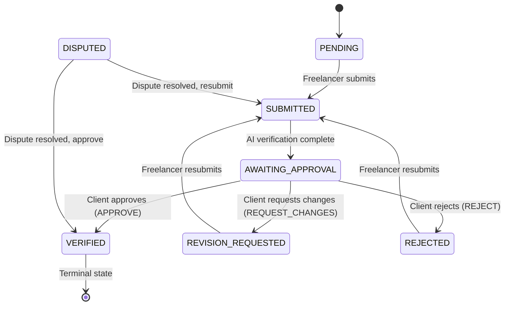
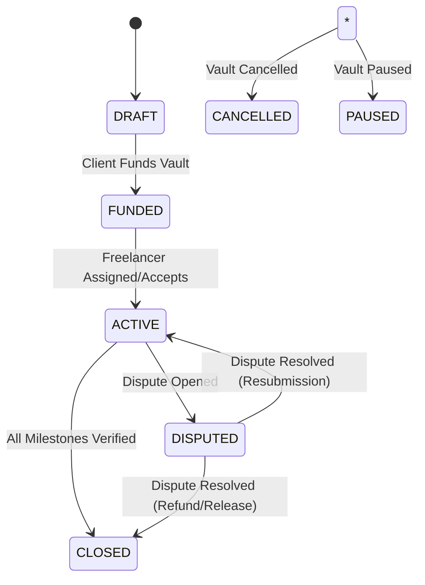

# Cleard Frontend Contract Specification

**Version**: 2.0  
**Last Updated**: 2026-01-29  
**Purpose**: Verification-ready contract specification for backend implementation

---

## Table of Contents

1. [Tech Stack](#tech-stack)
2. [App Routes Map](#app-routes-map)
3. [Frontend State Model](#frontend-state-model)
4. [Canonical Domain Enums](#canonical-domain-enums)
5. [Data Contracts](#data-contracts)
6. [Backend API Contract](#backend-api-contract)
7. [State Machine Specifications](#state-machine-specifications)
8. [Validation Rules](#validation-rules)
9. [Dispute & Approval Codes](#dispute--approval-codes)
10. [Open Questions / TODO](#open-questions--todo)
11. [Changelog](#changelog)

---

## Tech Stack

- **Framework**: Next.js 16 (App Router)
- **Runtime**: React 19
- **Styling**: Tailwind CSS 4
- **Animations**: Framer Motion
- **UI Components**: Radix UI + Lucide Icons
- **State Management**: React Context API (`UserContext`, `LedgerContext`, `VaultContext`)
- **Data Fetching**: Production API Client (`lib/api-client.js`)

---

## App Routes Map

### Public Routes

| Route                   | Access | Purpose                      | Data Read       | Actions                                            |
| ----------------------- | ------ | ---------------------------- | --------------- | -------------------------------------------------- |
| `/`                     | Public | Landing page                 | None            | Navigate to login/signup                           |
| `/login`                | Public | User login                   | None            | `api.auth.login()`                                 |
| `/signup`               | Public | User registration            | None            | `api.auth.signup()` (Auto-generates Smart Account) |
| `/forgot-password`      | Public | Password reset request       | None            | Email reset link                                   |
| `/reset-password`       | Public | Password reset form          | None            | Update password                                    |
| `/verify-email`         | Public | Email verification           | None            | Verify email token                                 |
| `/verification`         | Public | Public vault verification    | Vault by ID     | Display vault status                               |
| `/invite/[inviteToken]` | Public | Invitation acceptance        | Invite by token | `api.invites.respond()`                            |
| `/invitation-accepted`  | Public | Post-acceptance confirmation | None            | Display success                                    |
| `/onboarding/role`      | Public | Role selection               | Current user    | `api.onboarding.setRole()`                         |

### Protected Routes - Client

| Route                                                           | Access | Purpose              | Data Read                | Actions                   |
| --------------------------------------------------------------- | ------ | -------------------- | ------------------------ | ------------------------- |
| `/client`                                                       | Client | Dashboard            | Vaults list              | Navigate to vaults        |
| `/client/create-vault`                                          | Client | Create new vault     | None                     | `api.vaults.create()`     |
| `/client/vaults`                                                | Client | All vaults list      | Vaults list              | Filter/search vaults      |
| `/client/vault/[vaultId]`                                       | Client | Vault detail         | Vault + milestones       | Review, release, fund     |
| `/client/vault/[vaultId]/milestones/[milestoneId]`              | Client | Milestone detail     | Milestone + evidence     | View submission           |
| `/client/vault/[vaultId]/milestones/[milestoneId]/review`       | Client | Review milestone     | Milestone + submission   | `api.milestones.review()` |
| `/client/vault/[vaultId]/milestones/[milestoneId]/verification` | Client | Verification results | Milestone + verification | View AI audit             |
| `/client/ledger`                                                | Client | Settlement activity  | Ledger entries           | View transactions         |
| `/client/disputes`                                              | Client | Dispute center       | Disputes list            | Create/view disputes      |
| `/client/disputes/[disputeId]`                                  | Client | Dispute detail       | Dispute + evidence       | Add evidence              |
| `/client/disputes/create`                                       | Client | Create dispute       | Vaults + milestones      | `api.disputes.create()`   |
| `/client/ledger`                                                | Client | Ledger Settlement    | Ledger entries           | View transactions         |
| `/client/settings`                                              | Client | User settings        | User profile             | Update profile            |

### Protected Routes - Freelancer

| Route                                                               | Access     | Purpose               | Data Read                | Actions                   |
| ------------------------------------------------------------------- | ---------- | --------------------- | ------------------------ | ------------------------- |
| `/freelancer`                                                       | Freelancer | Dashboard             | Vaults + stats           | Navigate to work          |
| `/freelancer/active-work`                                           | Freelancer | Active vaults         | Active vaults            | View work                 |
| `/freelancer/balance`                                               | Freelancer | Balance & Withdrawals | Balance + transactions   | `api.ledger.withdraw()`   |
| `/freelancer/vaults`                                                | Freelancer | All vaults list       | Vaults list              | Filter vaults             |
| `/freelancer/vault/[vaultId]`                                       | Freelancer | Vault detail          | Vault + milestones       | Submit work               |
| `/freelancer/vault/[vaultId]/milestones/[milestoneId]`              | Freelancer | Milestone detail      | Milestone + evidence     | View requirements         |
| `/freelancer/vault/[vaultId]/milestones/[milestoneId]/submit`       | Freelancer | Submit deliverable    | Milestone                | `api.milestones.submit()` |
| `/freelancer/vault/[vaultId]/milestones/[milestoneId]/verification` | Freelancer | Verification results  | Milestone + verification | View AI audit             |
| `/freelancer/ledger`                                                | Freelancer | Earnings history      | Ledger entries           | View releases             |
| `/freelancer/disputes`                                              | Freelancer | Dispute center        | Disputes list            | Create/view disputes      |
| `/freelancer/disputes/[disputeId]`                                  | Freelancer | Dispute detail        | Dispute + evidence       | Add evidence              |
| `/freelancer/disputes/create`                                       | Freelancer | Create dispute        | Vaults + milestones      | `api.disputes.create()`   |
| `/freelancer/settings`                                              | Freelancer | User settings         | User profile             | Update profile            |

### Protected Routes - Shared

| Route                      | Access        | Purpose          | Data Read       | Actions                      |
| -------------------------- | ------------- | ---------------- | --------------- | ---------------------------- |
| `/onboarding/kyc`          | Authenticated | KYC verification | User            | `api.onboarding.submitKyc()` |
| `/withdraw`                | Freelancer    | Withdrawal flow  | Account balance | `api.ledger.withdraw()`      |
| `/checkout/[vaultId]`      | Client        | Vault funding    | Vault           | Fund vault                   |
| `/checkout/[vaultId]/card` | Client        | Card payment     | Vault           | Process payment              |
| `/checkout/[vaultId]/bank` | Client        | Bank transfer    | Vault           | Process transfer             |

---

## Frontend State Model

### UserContext (`lib/store/user-context.js`)

**State Shape**:

```javascript
{
  user: {
    id: string,
    email: string,
    name: string,
    role: UserRole,           // NONE | CLIENT | FREELANCER | ADMIN
    kycStatus: KycStatus,     // NONE | PENDING | VERIFIED | REJECTED
    profileImage: string | null
  } | null,
  loading: boolean
}
```

**Actions**:

- `login(email, password)` → Calls `api.auth.login()`, sets user
- `signup(email, password, name, role)` → Calls `api.auth.signup()`, sets user, and triggers automatic smart account provisioning
- `logout()` → Calls `api.auth.logout()`, clears user, redirects to `/login`
- `refreshUser()` → Calls `api.auth.getCurrentUser()`, updates user

**Side Effects**:

- On mount: Checks session via `api.auth.getCurrentUser()`
- On login/signup: Stores user in state
- On logout: Clears state and localStorage

**Caching**: User data persisted via production session cookies (or localStorage fallback)

---

### VaultContext (`lib/store/vault-context.js`)

**State Shape**:

```javascript
{
  vaults: Vault[],
  loading: boolean
}
```

**Actions**:

- `createVault(data)` → Calls `api.vaults.create()`, adds to vaults array
- `refreshVaults()` → Calls `api.vaults.list()`, replaces vaults array

**Side Effects**:

- On user change: Fetches vaults via `api.vaults.list()`
- On create: Optimistically adds vault to local state

**Caching**: Vaults array cached in memory, refetched on user change

---

### LedgerContext (`lib/store/ledger-context.js`)

**State Shape**:

```javascript
{
  balance: {
    available: number,      // USD available for withdrawal
    pending: number,        // USD pending confirmation
    total: number          // available + pending
  },
  transactions: Transaction[],
  loading: boolean
}
```

**Actions**:

- `withdraw(amount, bankDetails)` → Calls `api.ledger.withdraw()`, updates balance
- `refreshBalance()` → Calls `api.ledger.getBalance()`, updates balance
- `refreshTransactions()` → Calls `api.ledger.getTransactions()`, updates transactions

**Side Effects**:

- On mount: Fetches balance and transactions
- On withdraw: Moves funds from `available` to `pending`, polls for confirmation
- Polling: Checks transaction status every 2s for 10s max, updates when status changes to `CONFIRMED`

**Caching**: Balance and transactions cached in memory, refetched on mount

**Reconciliation Model**:

- Withdrawal initiation: `available -= amount`, `pending += amount`
- Withdrawal confirmation: `pending -= amount`
- Transaction status: `PENDING` → `CONFIRMED` (NOT `COMPLETED`)

---

## Canonical Domain Enums

**Source**: `lib/domain/enums.js` (SINGLE SOURCE OF TRUTH)

### VaultStatus

```javascript
{
  DRAFT: "DRAFT",                        // Initial creation state
  AWAITING_FUNDING: "AWAITING_FUNDING",  // Created but not funded
  INVITED: "INVITED",                    // Freelancer invited
  FUNDED_UNASSIGNED: "FUNDED_UNASSIGNED",// Funded, no freelancer
  FUNDED_ASSIGNED: "FUNDED_ASSIGNED",    // Funded with freelancer
  ACTIVE: "ACTIVE",                      // Work in progress
  IN_REVIEW: "IN_REVIEW",                // Under milestone review
  CLOSED: "CLOSED",                      // All milestones verified
  CANCELLED: "CANCELLED",                // Vault cancelled
  PAUSED: "PAUSED"                       // Temporarily paused
}
```

### MilestoneStatus

```javascript
{
  PENDING: "PENDING",                    // Not yet started
  SUBMITTED: "SUBMITTED",                // Freelancer submitted work
  AWAITING_APPROVAL: "AWAITING_APPROVAL",// Waiting for client review
  VERIFIED: "VERIFIED",                  // Approved, funds released
  REVISION_REQUESTED: "REVISION_REQUESTED", // Client requested changes
  REJECTED: "REJECTED",                  // Client rejected
  DISPUTED: "DISPUTED"                   // Under dispute resolution
}
```

### VerificationResult

```javascript
{
  PASS: "PASS",                          // All checks passed
  FAIL: "FAIL",                          // Objective requirement failed
  FLAGGED: "FLAGGED",                    // Suspicious data detected
  HUMAN_REVIEW: "HUMAN_REVIEW"           // Needs manual review
}
```

### MilestoneReviewOutcome

```javascript
{
  APPROVE: "APPROVE",                    // Maps to VERIFIED
  REQUEST_CHANGES: "REQUEST_CHANGES",    // Maps to REVISION_REQUESTED
  REJECT: "REJECT"                       // Maps to REJECTED
}
```

**CRITICAL**: Outcome ≠ Status. Backend must map outcome to status:

- `APPROVE` → `MilestoneStatus.VERIFIED`
- `REQUEST_CHANGES` → `MilestoneStatus.REVISION_REQUESTED`
- `REJECT` → `MilestoneStatus.REJECTED`

### TransactionStatus / LedgerEntryStatus

```javascript
{
  PENDING: "PENDING",                    // Transaction initiated
  CONFIRMED: "CONFIRMED",                // Transaction confirmed (NOT COMPLETED)
  FAILED: "FAILED"                       // Transaction failed
}
```

**CRITICAL**: Use `CONFIRMED`, NOT `COMPLETED`

### DisputeStatus

```javascript
{
  OPEN: "OPEN",                          // Dispute opened
  UNDER_REVIEW: "UNDER_REVIEW",          // Being reviewed
  NEEDS_INFO: "NEEDS_INFO",              // Awaiting information
  RESOLVED: "RESOLVED",                  // Dispute resolved
  REJECTED: "REJECTED"                   // Dispute rejected
}
```

### UserRole

```javascript
{
  NONE: "NONE",                          // Unauthenticated/onboarding only
  CLIENT: "CLIENT",                      // Client role
  FREELANCER: "FREELANCER",              // Freelancer role
  ADMIN: "ADMIN"                         // Admin role
}
```

### KycStatus

```javascript
{
  NONE: "NONE",                          // No KYC submitted
  PENDING: "PENDING",                    // KYC under review
  VERIFIED: "VERIFIED",                  // KYC approved
  REJECTED: "REJECTED"                   // KYC rejected
}
```

### LedgerEntryType

```javascript
{
  DEPOSIT: "DEPOSIT",                    // Funds added to vault
  LOCK: "LOCK",                          // Funds locked in escrow
  RELEASE: "RELEASE",                    // Funds released to freelancer
  REFUND: "REFUND",                      // Funds returned to client
  WITHDRAW: "WITHDRAW",                  // Funds withdrawn from wallet
  FEE: "FEE"                            // Platform/transaction fee
}
```

### InviteStatus

```javascript
{
  PENDING: "PENDING",                    // Invitation sent
  ACCEPTED: "ACCEPTED",                  // Invitation accepted
  DECLINED: "DECLINED",                  // Invitation declined
  EXPIRED: "EXPIRED"                     // Invitation expired
}
```

### DisputeType

```javascript
{
  VERIFICATION_ERROR: "VERIFICATION_ERROR",
  REQUIREMENT_MISMATCH: "REQUIREMENT_MISMATCH",
  SCOPE_CHANGE: "SCOPE_CHANGE",
  BAD_FAITH: "BAD_FAITH",
  FRAUD: "FRAUD",
  PROCESS_BREACH: "PROCESS_BREACH",
  SECURITY: "SECURITY"
}
```

### Forbidden / Removed Literals

❌ **DO NOT USE**:

- `"APPROVED"` → Use `MilestoneStatus.VERIFIED`
- `"PENDING_FUNDING"` → Use `VaultStatus.DRAFT` (funding is an action, not state)
- `"PASSED"` → Use `VerificationResult.PASS`
- `"FAILED"` (as milestone status) → Use `MilestoneStatus.REJECTED` or `VerificationResult.FAIL`
- `TransactionStatus.COMPLETED` → Use `TransactionStatus.CONFIRMED`
- Any lowercase status values

---

## Data Contracts

### User

**Source**: `lib/mock-api.js` (mockUser)

```typescript
{
  id: string;                    // e.g., "u_client_1"
  email: string;
  name: string;
  role: UserRole;                // NONE | CLIENT | FREELANCER | ADMIN
  kycStatus: KycStatus;          // NONE | PENDING | VERIFIED | REJECTED
  profileImage?: string | null;
  emailVerified?: boolean;
  createdAt?: string;            // ISO 8601
}
```

**Example**:

```json
{
  "id": "u_client_1",
  "email": "client@example.com",
  "name": "Demo Client",
  "role": "CLIENT",
  "kycStatus": "VERIFIED",
  "profileImage": null,
  "emailVerified": true
}
```

---

### Vault

**Source**: `lib/mock/vaults.js`

```typescript
{
  id: string;                    // e.g., "v_1"
  title: string;
  description?: string;
  type: string;                  // "development" | "design" | "content_ai" | "consulting"
  status: VaultStatus;           // UPPERCASE enum
  totalAmount: number;           // Total vault value (USD)
  clientId: string;
  clientName?: string;
  freelancerId?: string | null;
  freelancerName?: string;
  escrowRef?: string;            // Blockchain reference (hidden from UI)
  createdAt: string;             // ISO 8601
  milestones: Milestone[];       // Embedded array
}
```

**Example**:

```json
{
  "id": "v_1",
  "title": "Enterprise CRM Migration",
  "description": "Migration of legacy CRM data",
  "type": "development",
  "status": "ACTIVE",
  "totalAmount": 15000,
  "clientId": "u_client_1",
  "clientName": "Demo Client",
  "freelancerId": "u_freelancer_1",
  "freelancerName": "Demo Freelancer",
  "escrowRef": "v_1",
  "createdAt": "2025-01-10T10:00:00Z",
  "milestones": [...]
}
```

---

### Milestone

**Source**: `lib/mock/vaults.js`

```typescript
{
  id: string;                    // e.g., "m_101"
  title: string;
  status: MilestoneStatus;       // UPPERCASE enum
  amount: number;                // Release amount (USD)
  dueDate?: string;              // ISO 8601
  deliverableTypeId?: string;    // e.g., "github_repo"
  deliverableMode?: "LINK" | "FILE";
  auditEnabled?: boolean;        // Default true
  requirementItemsJson?: RequirementItem[];
  submission?: Submission;       // Embedded if exists
  verification?: Verification;   // Embedded if exists
  review?: MilestoneReview;      // Embedded if exists (client decision)
  approval?: {                   // Legacy field (same as review)
    status: string;
    decidedAt: string;
    reasonCodes: string[];
  };
}
```

**Example**:

```json
{
  "id": "m_101",
  "title": "Export integrity audit",
  "status": "VERIFIED",
  "amount": 5000,
  "dueDate": "2025-01-25",
  "deliverableTypeId": "github_repo",
  "deliverableMode": "LINK",
  "auditEnabled": true,
  "requirementItemsJson": [
    {
      "reqId": "REQ-101",
      "label": "CSV export delivered",
      "required": true
    }
  ],
  "submission": {...},
  "verification": {...}
}
```

---

### RequirementItem

**Source**: `lib/mock/vaults.js`

```typescript
{
  reqId: string;                 // UUID (crypto.randomUUID())
  label: string;                 // e.g., "CSV export delivered"
  required?: boolean;            // Default true
  acceptance?: string;           // Acceptance criteria
}
```

---

### Submission

**Source**: `lib/mock/vaults.js`

```typescript
{
  milestoneId?: string;
  submittedAt: string;           // ISO 8601
  submittedBy?: string;          // User ID
  notes?: string;
  filesJson?: SubmissionFile[];  // Array of uploaded files
  deliverableType?: "link" | "file";
  url?: string;                  // If deliverableType === "link"
  fileUrl?: string;              // If deliverableType === "file"
  fileHash?: string;
  fileSize?: number;
  fileMime?: string;
}
```

**Example**:

```json
{
  "submittedAt": "2025-01-20T09:00:00Z",
  "notes": "Export bundle uploaded",
  "filesJson": [
    {
      "name": "crm_export.csv",
      "size": "18MB",
      "tag": "Primary export"
    }
  ]
}
```

---

### SubmissionFile

```typescript
{
  name: string;
  size: string;                  // e.g., "2.4 MB"
  tag?: string;                  // e.g., "Source Code"
  url?: string;
}
```

---

### Verification

**Source**: `lib/mock/vaults.js`

```typescript
{
  milestoneId?: string;
  result: VerificationResult;    // PASS | FAIL | FLAGGED | HUMAN_REVIEW
  verifiedAt: string | null;     // ISO 8601
  verifiedBy?: "AI" | "HUMAN";
  confidence?: number;           // 0-100
  checksCompleted?: number;
  checksTotal?: number;
  riskLevel?: "LOW" | "MEDIUM" | "HIGH";
  flags?: string[];
  checks?: string[];             // Array of check descriptions
  ruleResultsJson?: {
    code: string;
    passed: boolean;
    message: string;
  }[];
  notes?: string;
}
```

**Example**:

```json
{
  "result": "PASS",
  "verifiedAt": "2025-01-22T13:10:00Z",
  "verifiedBy": "AI",
  "ruleResultsJson": [
    {
      "code": "ROW_COUNT",
      "passed": true,
      "message": "Row count matches signed brief"
    }
  ]
}
```

---

### MilestoneReview

**Source**: `lib/mock-api.js` (milestones.review)

```typescript
{
  milestoneId: string;
  reviewerId?: string;           // Client user ID
  outcome: MilestoneReviewOutcome; // APPROVE | REQUEST_CHANGES | REJECT
  reasonCodes?: string[];        // From APPROVAL_REJECTION_CODES
  notes?: string;
  reviewedAt: string;            // ISO 8601
}
```

**CRITICAL**: `outcome` is NOT the same as `milestone.status`. Backend must map:

- `APPROVE` → `status = VERIFIED`
- `REQUEST_CHANGES` → `status = REVISION_REQUESTED`
- `REJECT` → `status = REJECTED`

**Example**:

```json
{
  "milestoneId": "m_101",
  "outcome": "APPROVE",
  "reasonCodes": [],
  "notes": "Looks good!",
  "reviewedAt": "2025-01-22T14:00:00Z"
}
```

---

### Dispute

**Source**: `lib/mock/disputes.js`

```typescript
{
  id: string;                    // e.g., "d_001"
  vaultId: string;
  milestoneId: string;
  requirementRef?: string;       // reqId if requirement-specific
  disputeType: DisputeType;      // From DisputeType enum
  reasonCode: string;            // From DISPUTE_REASON_CODES
  openedByUserId: string;
  openedByRole: UserRole;        // CLIENT | FREELANCER | ADMIN
  status: DisputeStatus;         // OPEN | UNDER_REVIEW | NEEDS_INFO | RESOLVED | REJECTED
  description: string;
  evidence?: string[];           // Array of evidence URLs
  resolution?: string;
  createdAt: string;             // ISO 8601
  updatedAt?: string;
  resolvedAt?: string;
}
```

**Example**:

```json
{
  "id": "d_001",
  "vaultId": "v_1",
  "milestoneId": "m_101",
  "disputeType": "VERIFICATION_ERROR",
  "reasonCode": "VERIFICATION_ERROR",
  "openedByUserId": "u_freelancer_1",
  "openedByRole": "FREELANCER",
  "status": "OPEN",
  "description": "AI incorrectly flagged valid CSV export",
  "createdAt": "2025-01-23T10:00:00Z"
}
```

---

### LedgerEntry / Transaction

**Source**: `lib/mock/ledger.js`

```typescript
{
  id: string;                    // e.g., "lg_1001"
  date: string;                  // ISO 8601
  vaultId?: string;
  milestoneId?: string;
  type: LedgerEntryType;         // DEPOSIT | LOCK | RELEASE | REFUND | WITHDRAW | FEE
  status: TransactionStatus;     // PENDING | CONFIRMED | FAILED
  amount: number;                // USD
  description: string;
  completedAt?: string;          // ISO 8601
}
```

**Example**:

```json
{
  "id": "lg_1001",
  "date": "2025-01-22T14:00:00Z",
  "vaultId": "v_1",
  "milestoneId": "m_101",
  "type": "RELEASE",
  "status": "CONFIRMED",
  "amount": 5000,
  "description": "Milestone m_101 released",
  "completedAt": "2025-01-22T14:00:05Z"
}
```

---

### LedgerBalance

**Source**: `lib/mock-api.js` (ledger.getBalance)

```typescript
{
  available: number; // USD available for withdrawal
  pending: number; // USD pending confirmation
  total: number; // available + pending
}
```

---

### Invite

**Source**: `lib/mock/invites.js`

```typescript
{
  id: string;                    // e.g., "inv_001"
  token: string;                 // Unique invite token
  vaultId: string;
  email: string;                 // Invited freelancer email
  status: InviteStatus;          // PENDING | ACCEPTED | DECLINED | EXPIRED
  invitedAt: string;             // ISO 8601
  expiresAt: string;             // ISO 8601
  respondedAt?: string;
  declineReason?: string;
}
```

---

### Evidence

**Source**: `lib/mock/evidence.js`
Communication and milestones events are stored here as an append-only log.

```typescript
interface Evidence {
  id: string; // e.g., "ev_101"
  vaultId: string;
  milestoneId?: string;
  disputeId?: string;
  type: EvidenceType; // MESSAGE_SENT | SUBMISSION_CREATED | etc.
  actorUserId: string;
  actorRole: UserRole;
  payloadJson: {
    content?: string; // Primary message content
    filesJson?: string; // Optional attachments
    supersedesEventId?: string; // If this is an edit of a previous event
    [key: string]: any; // Event-specific data
  };
  contentHash: string; // SHA-256 for integrity
  createdAt: string; // ISO 8601
}
```

---

## Backend API Contract

**Source**: `lib/mock-api.js`

All endpoints must return structured error responses with `code`, `message`, and relevant context.

### Authentication & User Management

#### `POST /api/auth/signup`

**Used by Frontend**: ✅ Yes  
**Location**: `lib/mock-api.js:api.auth.signup`

**Request**:

```typescript
{
  email: string;                 // Valid email
  password: string;              // Min 8 chars
  name: string;
  role?: UserRole;               // Optional initial role
}
```

**Response**:

```typescript
User;
```

**Errors**:

- `EMAIL_EXISTS`: Email already registered
- `INVALID_EMAIL`: Invalid email format
- `WEAK_PASSWORD`: Password too weak

---

#### `POST /api/auth/login`

**Used by Frontend**: ✅ Yes  
**Location**: `lib/mock-api.js:api.auth.login`

**Request**:

```typescript
{
  email: string;
  password: string;
}
```

**Response**:

```typescript
User;
```

**Errors**:

- `INVALID_CREDENTIALS`: Email or password incorrect
- `ACCOUNT_SUSPENDED`: Account suspended

---

#### `POST /api/auth/logout`

**Used by Frontend**: ✅ Yes  
**Location**: `lib/mock-api.js:api.auth.logout`

**Request**: None

**Response**:

```typescript
{
  success: boolean;
}
```

---

#### `GET /api/auth/me`

**Used by Frontend**: ✅ Yes  
**Location**: `lib/mock-api.js:api.auth.getCurrentUser`

**Request**: None (uses session/token)

**Response**:

```typescript
User;
```

**Errors**:

- `UNAUTHORIZED`: No valid session

---

### Onboarding

#### `PATCH /api/onboarding/role`

**Used by Frontend**: ✅ Yes  
**Location**: `lib/mock-api.js:api.onboarding.setRole`

**Request**:

```typescript
{
  role: UserRole; // CLIENT | FREELANCER
}
```

**Response**:

```typescript
User;
```

**Errors**:

- `INVALID_ROLE`: Role must be CLIENT or FREELANCER
- `ROLE_ALREADY_SET`: Cannot change role after KYC

---

#### `POST /api/onboarding/kyc`

**Used by Frontend**: ✅ Yes  
**Location**: `lib/mock-api.js:api.onboarding.submitKyc`

**Request**:

```typescript
{
  fullName: string;
  dateOfBirth: string; // ISO 8601
  address: string;
  idDocument: string; // File URL or base64
  // Additional KYC fields
}
```

**Response**:

```typescript
User;
```

**Errors**:

- `KYC_INCOMPLETE`: Missing required fields
- `KYC_ALREADY_VERIFIED`: KYC already verified

---

#### `GET /api/onboarding/status`

**Used by Frontend**: ✅ Yes  
**Location**: `lib/mock-api.js:api.onboarding.getStatus`

**Request**: None

**Response**:

```typescript
{
  roleSet: boolean;
  kycVerified: boolean;
  emailVerified: boolean;
}
```

---

### Vault Management

#### `POST /api/vaults`

**Used by Frontend**: ✅ Yes  
**Location**: `lib/mock-api.js:api.vaults.create`

**Request**:

```typescript
{
  title: string;                 // Required
  description?: string;
  type: string;                  // "development" | "design" | "content_ai" | "consulting"
  totalAmount: number;           // USD, > 0
  milestones: {
    title: string;
    amount: number;
    dueDate?: string;
    deliverableTypeId?: string;
    deliverableMode?: "LINK" | "FILE";
    auditEnabled?: boolean;
    requirementItemsJson?: RequirementItem[];
  }[];
  idempotencyKey?: string;       // Optional for create operations
}
```

**Response**:

```typescript
Vault;
```

**Validation**:

- `totalAmount` must equal sum of milestone amounts
- At least 1 milestone required
- Each milestone amount > 0

**Errors**:

- `AMOUNT_MISMATCH`: Total doesn't match milestone sum
- `NO_MILESTONES`: At least 1 milestone required
- `DUPLICATE_REQUEST`: Idempotency key already used

---

#### `GET /api/vaults`

**Used by Frontend**: ✅ Yes  
**Location**: `lib/mock-api.js:api.vaults.list`

**Request**: None (filtered by user role)

**Response**:

```typescript
Vault[]
```

**Filtering**:

- Client: Returns vaults where `clientId === user.id`
- Freelancer: Returns vaults where `freelancerId === user.id`

---

#### `GET /api/vaults/:id`

**Used by Frontend**: ✅ Yes  
**Location**: `lib/mock-api.js:api.vaults.getById`

**Request**: None

**Response**:

```typescript
Vault;
```

**Errors**:

- `VAULT_NOT_FOUND`: Vault doesn't exist
- `UNAUTHORIZED`: User not authorized to view vault

---

#### `POST /api/vaults/:id/fund`

**Used by Frontend**: ❌ Not implemented (checkout flow incomplete)  
**Required for Backend**: ✅ Yes

**Request**:

```typescript
{
  paymentMethod: "card" | "bank";
  paymentDetails: object; // Payment provider specific
  idempotencyKey: string; // Required for money operations
}
```

**Response**:

```typescript
Vault;
```

**State Transition**:

- `DRAFT` → `AWAITING_FUNDING` → `FUNDED_UNASSIGNED` or `FUNDED_ASSIGNED`

**Errors**:

- `PAYMENT_FAILED`: Payment processing failed
- `INVALID_STATE`: Vault not in DRAFT or AWAITING_FUNDING
- `DUPLICATE_FUNDING`: Idempotency key already used

---

#### `POST /api/vaults/:id/release-milestone`

**Used by Frontend**: ✅ Yes  
**Location**: `lib/mock-api.js:api.vaults.releaseMilestone`

**Request**:

```typescript
{
  milestoneId: string;
  idempotencyKey: string; // Required for money operations
}
```

**Response**:

```typescript
Milestone;
```

**State Guards** (MUST ENFORCE):

1. Milestone status must be `AWAITING_APPROVAL`
2. If `auditEnabled !== false`:
   - `milestone.verification` must exist
   - `milestone.auditStatus` is advisory only (does not block)
3. Caller must be vault client
4. If `milestone.auditStatus === 'FAIL'`:
   - Client must acknowledge warning via `acknowledgeAuditWarning: true`
   - Log warning: "Client approved milestone despite AI FAIL"

**State Transition**:

- `AWAITING_APPROVAL` → `VERIFIED`
- Creates `RELEASE` ledger entry
- Updates freelancer wallet balance

**Errors**:

- `INVALID_STATE_TRANSITION`: Milestone not in AWAITING_APPROVAL
- `VERIFICATION_REQUIRED`: Verification missing when audit enabled
- `AUDIT_WARNING_NOT_ACKNOWLEDGED`: Client must acknowledge AI warning when auditStatus = FAIL
- `UNAUTHORIZED`: Caller is not vault client
- `DUPLICATE_RELEASE`: Idempotency key already used

**Code Location**: `lib/mock-api.js:vaults.releaseMilestone` (lines 367-440)

---

### Invitations

#### `POST /api/invites`

**Used by Frontend**: ✅ Yes  
**Location**: `lib/mock-api.js:api.invites.create`

**Request**:

```typescript
{
  vaultId: string;
  email: string;                 // Freelancer email
  expiresIn?: number;            // Days until expiration (default 7)
}
```

**Response**:

```typescript
Invite;
```

**Errors**:

- `VAULT_NOT_FOUND`: Vault doesn't exist
- `UNAUTHORIZED`: Caller is not vault client
- `ALREADY_ASSIGNED`: Vault already has freelancer

---

#### `GET /api/invites/token/:token`

**Used by Frontend**: ✅ Yes  
**Location**: `lib/mock-api.js:api.invites.getByToken`

**Request**: None

**Response**:

```typescript
Invite;
```

**Errors**:

- `INVITE_NOT_FOUND`: Invalid token
- `INVITE_EXPIRED`: Invitation expired

---

#### `POST /api/invites/:token/respond`

**Used by Frontend**: ✅ Yes  
**Location**: `lib/mock-api.js:api.invites.respond`

**Request**:

```typescript
{
  action: "accept" | "decline";
  declineReason?: string;        // Required if action === "decline"
}
```

**Response**:

```typescript
{
  invite: Invite;
  vault?: Vault;                 // Included if accepted
}
```

**State Transition** (if accepted):

- Invite: `PENDING` → `ACCEPTED`
- Vault: `FUNDED_UNASSIGNED` → `FUNDED_ASSIGNED`

**Errors**:

- `INVITE_EXPIRED`: Invitation expired
- `INVITE_ALREADY_RESPONDED`: Already accepted/declined
- `UNAUTHORIZED`: User email doesn't match invite

---

### Milestone Workflow

#### `POST /api/milestones/:id/submit`

**Used by Frontend**: ✅ Yes  
**Location**: `lib/mock-api.js:api.milestones.submit`

**Request**:

```typescript
{
  files?: { name: string; size: number }[];
  comments?: string;
  url?: string;                  // If deliverableMode === "LINK"
  fileUrl?: string;              // If deliverableMode === "FILE"
}
```

**Response**:

```typescript
Milestone;
```

**State Guards**:

- Milestone status must be `PENDING`, `REVISION_REQUESTED`, or `REJECTED`

**State Transition**:

- `PENDING` | `REVISION_REQUESTED` | `REJECTED` → `SUBMITTED`
- Triggers AI verification (async)

**Errors**:

- `INVALID_STATE_TRANSITION`: Cannot submit from current status
- `UNAUTHORIZED`: Caller is not vault freelancer

**Code Location**: `lib/mock-api.js:milestones.submit` (lines 625-662)

---

#### `POST /api/milestones/:id/verify`

**Used by Frontend**: ❌ Not directly called (system-triggered)  
**Required for Backend**: ✅ Yes

**Request**: None (system-triggered after submission)

**Response**:

```typescript
Milestone;
```

**State Transition**:

- `SUBMITTED` → `AWAITING_APPROVAL`
- Creates `verification` object with result

**AI Verification Logic**:

- Runs objective checks (file presence, format validation, etc.)
- Sets `result`: `PASS` | `FAIL` | `FLAGGED` | `HUMAN_REVIEW`
- Never automatically releases funds

**Code Location**: `lib/mock-api.js:milestones.verify` (lines 664-707)

---

#### `POST /api/milestones/:id/review`

**Used by Frontend**: ✅ Yes  
**Location**: `lib/mock-api.js:api.milestones.review`

**Request**:

```typescript
{
  outcome: MilestoneReviewOutcome; // APPROVE | REQUEST_CHANGES | REJECT
  reasonCodes?: string[];        // From APPROVAL_REJECTION_CODES
  notes?: string;
}
```

**Response**:

```typescript
Milestone;
```

**State Guards**:

- Milestone status must be `AWAITING_APPROVAL`

**Outcome → Status Mapping** (CRITICAL):

- `APPROVE` → `VERIFIED`
- `REQUEST_CHANGES` → `REVISION_REQUESTED`
- `REJECT` → `REJECTED`

**State Transition**:

- `AWAITING_APPROVAL` → `VERIFIED` | `REVISION_REQUESTED` | `REJECTED`

**Errors**:

- `INVALID_STATE_TRANSITION`: Milestone not in AWAITING_APPROVAL
- `INVALID_REVIEW_OUTCOME`: Invalid outcome value
- `UNAUTHORIZED`: Caller is not vault client

**Code Location**: `lib/mock-api.js:milestones.review` (lines 750-801)

---

#### `GET /api/milestones/:id/evidence`

**Used by Frontend**: ✅ Yes  
**Location**: `lib/mock-api.js:api.milestones.getEvidence`

**Request**: None

**Response**:

```typescript
Evidence[]
```

**Evidence Types**:

- `SUBMISSION_CREATED`
- `VERIFICATION_COMPLETED`
- `REVIEW_SUBMITTED`
- `MESSAGE_SENT`
- `MESSAGE_EDITED`
- `FILE_COMMENT`
- `DISPUTE_OPENED`
- `DISPUTE_EVIDENCE`
- `DISPUTE_DECISION`

---

#### `POST /api/evidence`

**Used by Frontend**: ✅ Yes (Redesigned from Comments)  
**Purpose**: Post new message or evidence event (Append-only)

**Request**:

```typescript
{
  vaultId: string;
  milestoneId?: string;
  type: EvidenceType;
  payload: {
    content: string;
    filesJson?: string;
    supersedesEventId?: string; // For MESSAGE_EDITED
  };
}
```

**Response**:

```typescript
Evidence;
```

**Business Rules**:

- Edits append a new `MESSAGE_EDITED` event.
- Frontend should hide superseded events by default.

---

### Dispute Management

#### `POST /api/disputes`

**Used by Frontend**: ✅ Yes  
**Location**: `lib/mock-api.js:api.disputes.create`

**Request**:

```typescript
{
  vaultId: string;
  milestoneId: string;
  requirementRef?: string;       // reqId if requirement-specific
  disputeType: DisputeType;
  reasonCode: string;            // From DISPUTE_REASON_CODES
  description: string;
}
```

**Response**:

```typescript
Dispute;
```

**Validation**:

- `disputeType` must be valid DisputeType
- `reasonCode` must match dispute eligibility rules
- If `requiresRequirementRef`, `requirementRef` must be provided

**Errors**:

- `INVALID_DISPUTE_TYPE`: Invalid dispute type
- `INELIGIBLE_DISPUTE`: Dispute not allowed for current milestone state
- `MISSING_REQUIREMENT_REF`: requirementRef required but not provided

**Code Location**: `lib/mock-api.js:disputes.create` (lines 485-530)

---

#### `GET /api/disputes`

**Used by Frontend**: ✅ Yes  
**Location**: `lib/mock-api.js:api.disputes.list`

**Request**: None (filtered by user role)

**Response**:

```typescript
Dispute[]
```

**Filtering**:

- Returns disputes where user is involved (client or freelancer of vault)

---

#### `GET /api/disputes/:id`

**Used by Frontend**: ✅ Yes  
**Location**: `lib/mock-api.js:api.disputes.getById`

**Request**: None

**Response**:

```typescript
Dispute;
```

**Errors**:

- `DISPUTE_NOT_FOUND`: Dispute doesn't exist
- `UNAUTHORIZED`: User not authorized to view dispute

---

### Financial & Ledger

#### `GET /api/ledger/balance`

**Used by Frontend**: ✅ Yes  
**Location**: `lib/mock-api.js:api.ledger.getBalance`

**Request**: None

**Response**:

```typescript
{
  available: number;
  pending: number;
  total: number;
}
```

---

#### `GET /api/ledger/transactions`

**Used by Frontend**: ✅ Yes  
**Location**: `lib/mock-api.js:api.ledger.getTransactions`

**Request**: None

**Response**:

```typescript
Transaction[]
```

---

#### `POST /api/ledger/withdraw`

**Used by Frontend**: ✅ Yes  
**Location**: `lib/mock-api.js:api.ledger.withdraw`

**Request**:

```typescript
{
  amount: number; // USD, > 0
  bankDetails: {
    accountNumber: string;
    routingNumber: string;
    accountName: string;
  }
  idempotencyKey: string; // Required for money operations
}
```

**Response**:

```typescript
Transaction;
```

**Reconciliation Model**:

1. Initiation: Move funds from `available` to `pending`
2. Confirmation (async): Decrement `pending`, update transaction status to `CONFIRMED`

**State Transition**:

- Transaction: `PENDING` → `CONFIRMED` (after ~3s in mock)

**Errors**:

- `INSUFFICIENT_FUNDS`: Amount exceeds available balance
- `INVALID_AMOUNT`: Amount <= 0
- `DUPLICATE_WITHDRAWAL`: Idempotency key already used

**Code Location**: `lib/mock-api.js:wallet.withdraw` (lines 276-317)

---

#### `GET /api/ledger`

**Used by Frontend**: ✅ Yes  
**Location**: `lib/mock-api.js:api.ledger.getEntries`

**Request**: Query params for filtering

**Response**:

```typescript
LedgerEntry[]
```

**Filtering**:

- By user role (client sees deposits/refunds, freelancer sees releases/withdrawals)
- By vault ID
- By date range

---

## State Machine Specifications

### Milestone Status Transitions

**Source**: `lib/mock-api.js` (state transition guards)



**Allowed Transitions**:

| From               | To                 | Trigger                                   | Actor             | Code Location              |
| ------------------ | ------------------ | ----------------------------------------- | ----------------- | -------------------------- |
| PENDING            | SUBMITTED          | Submit deliverable                        | Freelancer        | `milestones.submit` (L625) |
| REVISION_REQUESTED | SUBMITTED          | Resubmit work                             | Freelancer        | `milestones.submit` (L625) |
| REJECTED           | SUBMITTED          | Resubmit work                             | Freelancer        | `milestones.submit` (L625) |
| SUBMITTED          | AWAITING_APPROVAL  | AI verification complete                  | System            | `milestones.verify` (L664) |
| AWAITING_APPROVAL  | VERIFIED           | Client approves (APPROVE)                 | Client            | `milestones.review` (L750) |
| AWAITING_APPROVAL  | REVISION_REQUESTED | Client requests changes (REQUEST_CHANGES) | Client            | `milestones.review` (L750) |
| AWAITING_APPROVAL  | REJECTED           | Client rejects (REJECT)                   | Client            | `milestones.review` (L750) |
| \*                 | DISPUTED           | File dispute                              | Client/Freelancer | `disputes.create` (L485)   |

**Forbidden Transitions**:

- ❌ `VERIFIED` → any state (terminal)
- ❌ `PENDING` → `VERIFIED` (must go through submission)
- ❌ `SUBMITTED` → `VERIFIED` (must go through approval)
- ❌ Any status → `PENDING` (cannot reset)

---

### Vault Status Transitions

**Source**: `lib/mock-api.js`



**Allowed Transitions**:

| From     | To        | Trigger                               | Actor        |
| -------- | --------- | ------------------------------------- | ------------ |
| DRAFT    | FUNDED    | Lock funds in escrow                  | Client       |
| FUNDED   | ACTIVE    | Freelancer accepts invitation         | Freelancer   |
| ACTIVE   | CLOSED    | Final milestone reaches VERIFIED      | System       |
| ACTIVE   | DISPUTED  | Dispute record created                | Party        |
| DISPUTED | ACTIVE    | Dispute resolved (allow resubmit)     | Admin        |
| DISPUTED | CLOSED    | Dispute resolved (refund/release all) | Admin        |
| \*       | CANCELLED | Kill switch triggered                 | Client/Admin |
| \*       | PAUSED    | Temporary hold                        | Admin        |

> [!NOTE]
> Granular states like `AWAITING_FUNDING` or `INVITED` are **computed views** derived from the presence of transactions or invite records while the vault is in `DRAFT` or `FUNDED` states.

---

### Release Safety Conditions

**Source**: `lib/mock-api.js:vaults.releaseMilestone` (L367-440)

**MUST ENFORCE** (Backend):

1. **State Guard**: Milestone status === `AWAITING_APPROVAL`
2. **Verification Guard** (if `auditEnabled !== false`):
   - `milestone.verification` must exist
   - `milestone.auditStatus` is advisory only (does not block)
3. **Authorization Guard**: Caller must be vault client
4. **AI Advisory Guard**: If `auditStatus === 'FAIL'`:
   - Require `acknowledgeAuditWarning: true`
   - Log warning for audit trail
5. **Idempotency**: Use `idempotencyKey` to prevent duplicate releases

**Error Codes**:

- `INVALID_STATE_TRANSITION`
- `VERIFICATION_REQUIRED`
- `AUDIT_WARNING_NOT_ACKNOWLEDGED`
- `UNAUTHORIZED`
- `DUPLICATE_RELEASE`

---

## Validation Rules

### Frontend Validations

**Source**: Various form components

#### Vault Creation

- `title`: Required, 1-200 chars
- `description`: Optional, max 1000 chars
- `type`: Required, one of: `development`, `design`, `content_ai`, `consulting`
- `totalAmount`: Required, > 0, must equal sum of milestone amounts
- `milestones`: At least 1 required
  - `title`: Required, 1-200 chars
  - `amount`: Required, > 0
  - `dueDate`: Optional, must be future date
  - `requirementItemsJson`: Optional array
    - `reqId`: Auto-generated UUID
    - `label`: Required, 1-200 chars

#### Milestone Submission

- `files` OR `url`: At least one required
- `comments`: Optional, max 1000 chars

#### Milestone Review

- `outcome`: Required, one of: `APPROVE`, `REQUEST_CHANGES`, `REJECT`
- `reasonCodes`: Optional array of strings
- `notes`: Optional, max 1000 chars

#### Dispute Creation

- `vaultId`: Required
- `milestoneId`: Required
- `disputeType`: Required, valid DisputeType
- `reasonCode`: Required, valid reason code
- `description`: Required, 10-2000 chars
- `requirementRef`: Required if dispute type requires it

#### Wallet Withdrawal

- `amount`: Required, > 0, <= available balance
- `bankDetails.accountNumber`: Required
- `bankDetails.routingNumber`: Required
- `bankDetails.accountName`: Required

---

### Backend-Only Validations

**MUST ENFORCE** (even if frontend checks):

1. **Money Operations**:
   - All amounts must be positive
   - Vault total must equal milestone sum
   - Withdrawal amount must not exceed available balance
   - Idempotency keys required for all money operations

2. **State Transitions**:
   - All milestone status transitions must follow state machine
   - Release safety conditions must be enforced
   - Cannot modify terminal states (VERIFIED)

3. **Authorization**:
   - Clients can only access their vaults
   - Freelancers can only access assigned vaults
   - Only vault client can approve/release milestones
   - Only vault freelancer can submit work

4. **Data Integrity**:
   - RequirementItem.reqId must be unique within milestone
   - Ledger entries are append-only (immutable)
   - Verification result cannot change after VERIFIED status

5. **File Uploads**:
   - Max file size: 100MB (configurable)
   - Allowed types: PDF, ZIP, PNG, JPG, CSV, XLSX, etc.
   - Files must be virus-scanned before storage

---

## Dispute & Approval Codes

### Dispute Reason Codes

**Source**: `lib/rules/disputes.js`

#### AI Verification Disputes

```javascript
[
  {
    code: "VERIFICATION_ERROR",
    label: "Verification Error",
    description: "Objective verification was applied incorrectly.",
    verificationResults: ["FAIL", "FLAGGED"],
    statuses: ["REJECTED"],
    requiresRequirementRef: true,
  },
  {
    code: "REQUIREMENT_MISMATCH",
    label: "Requirement Mismatch",
    description: "Deliverable meets requirement but was flagged.",
    verificationResults: ["FAIL", "FLAGGED"],
    statuses: ["REJECTED"],
    requiresRequirementRef: true,
  },
];
```

#### Client Approval Disputes

```javascript
[
  {
    code: "BAD_FAITH",
    label: "Bad Faith Rejection",
    description: "Client rejected valid work repeatedly/maliciously.",
    verificationResults: ["PASS"],
    statuses: ["REJECTED"],
    requiresRequirementRef: false,
  },
  {
    code: "SCOPE_CHANGE",
    label: "Scope Change",
    description: "Rejection due to requirements not in original scope.",
    verificationResults: ["PASS"],
    statuses: ["REJECTED"],
    requiresRequirementRef: false,
  },
];
```

#### Process & Security Disputes

```javascript
[
  {
    code: "PROCESS_BREACH",
    label: "Process Breach",
    description: "System process was circumvented.",
    verificationResults: ["PASS", "FAIL", "FLAGGED", "HUMAN_REVIEW"],
    statuses: ["VERIFIED", "REJECTED"],
    requiresRequirementRef: false,
  },
  {
    code: "FRAUD",
    label: "Fraudulent Activity",
    description: "Evidence of fake data or bad faith.",
    verificationResults: ["PASS", "FAIL", "FLAGGED", "HUMAN_REVIEW"],
    statuses: ["VERIFIED", "REJECTED"],
    requiresRequirementRef: false,
  },
  {
    code: "SECURITY",
    label: "Security Concern",
    description: "Malicious code or security risk detected.",
    verificationResults: ["PASS", "FAIL", "FLAGGED", "HUMAN_REVIEW"],
    statuses: ["VERIFIED", "REJECTED"],
    requiresRequirementRef: false,
  },
];
```

---

### Approval Rejection Codes

**Source**: `lib/rules/milestones.js`

```javascript
[
  {
    code: "REQ_MISSED",
    label: "Requirement missed",
    description: "One or more listed requirements were not met.",
  },
  {
    code: "QUALITY_GAP",
    label: "Quality gap",
    description: "Work quality does not meet the defined standard.",
  },
  {
    code: "EVIDENCE_INCOMPLETE",
    label: "Evidence incomplete",
    description: "Required proof or files are missing.",
  },
  {
    code: "REVISION_REQUIRED",
    label: "Revision required",
    description: "Deliverable needs a revision before approval.",
  },
];
```

---

## Open Questions / TODO

### Ambiguities

1. **deliverableTypeId vs deliverableId**:
   - Some milestones use `deliverableTypeId` (e.g., "github_repo")
   - Some use `deliverableId` (e.g., "live_webapp")
   - **Recommendation**: Standardize on `deliverableTypeId`

2. **approval vs review**:
   - Mock data uses both `approval` and `review` fields
   - **Recommendation**: Use `review` as canonical, deprecate `approval`

3. **Vault paidAmount**:
   - Not present in mock data
   - **Recommendation**: Add `paidAmount` field (sum of VERIFIED milestone amounts)

4. **Transaction polling**:
   - Frontend polls for transaction status updates
   - **Recommendation**: Implement webhooks or SSE for real-time updates

5. **File upload flow**:
   - Frontend doesn't implement actual file uploads
   - **Recommendation**: Define S3/CDN upload flow with presigned URLs

---

### Proposed Backend Additions

**NOT CANONICAL** (not in frontend yet):

1. **Webhook Endpoints**:
   - `POST /api/webhooks/transaction-confirmed`
   - `POST /api/webhooks/verification-complete`

2. **Admin Endpoints**:
   - `GET /api/admin/users`
   - `PATCH /api/admin/users/:id/suspend`
   - `GET /api/admin/disputes`
   - `POST /api/admin/disputes/:id/resolve`

3. **Analytics Endpoints**:
   - `GET /api/analytics/vault-stats`
   - `GET /api/analytics/milestone-completion-rate`

4. **Notification Endpoints**:
   - `GET /api/notifications`
   - `PATCH /api/notifications/:id/read`

---

## Changelog

### Changes from Previous Version

1. **Enums Updated**:
   - Added `IN_REVIEW`, `PAUSED` to `VaultStatus`
   - Changed `VerificationResult`: `PASSED`/`FAILED` → `PASS`/`FAIL`
   - Added `FLAGGED`, `HUMAN_REVIEW` to `VerificationResult`
   - Added `MilestoneReviewOutcome` enum
   - Changed `TransactionStatus`: `COMPLETED` → `CONFIRMED`
   - Added `NONE`, `ADMIN` to `UserRole`
   - Added `NEEDS_INFO`, `REJECTED` to `DisputeStatus`

2. **Non-Canonical Literals Removed**:
   - Removed `"APPROVED"` (use `MilestoneStatus.VERIFIED`)
   - Removed `"PENDING_FUNDING"` (use `VaultStatus.DRAFT`)
   - Removed `"PASSED"` (use `VerificationResult.PASS`)
   - Removed `"FAILED"` as milestone status

3. **API Contract Clarifications**:
   - Added state transition guards documentation
   - Added error code specifications
   - Added idempotency key requirements
   - Documented wallet reconciliation model

4. **Data Contract Updates**:
   - Added `WalletBalance` contract
   - Clarified `MilestoneReview` vs `approval` field
   - Added `TransactionStatus` to ledger entries

5. **State Machine Documentation**:
   - Added code locations for all transitions
   - Documented release safety conditions
   - Added forbidden transitions list

---

**End of Frontend Contract Specification**
